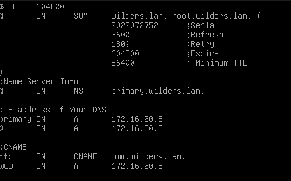
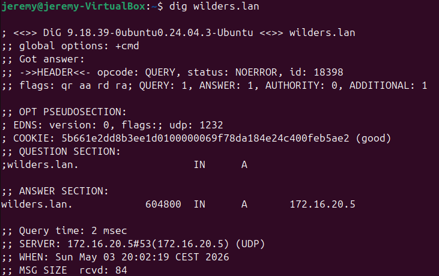
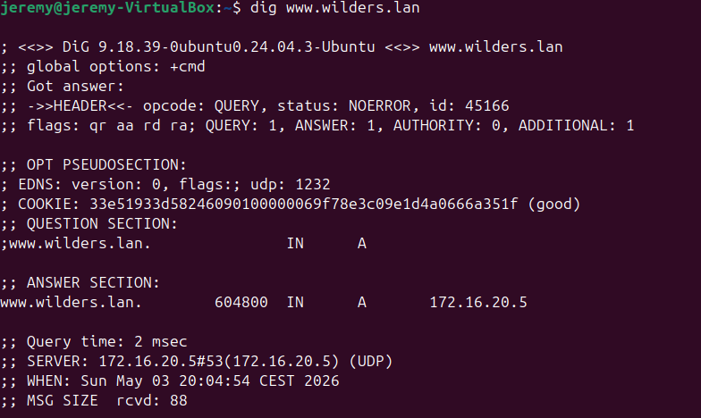

# TP DNS — Debian Serv `wilders.lan`

**Serveur DNS :** `172.16.20.5`  
**Zone directe :** `wilders.lan`
**CNAME :** `www.wilders.lan`

---

## 1. Fichier Config

## 2. Ping vers le nom A — `wilders.lan`

## 3. Ping vers le CNAME — `www.wilders.lan`

