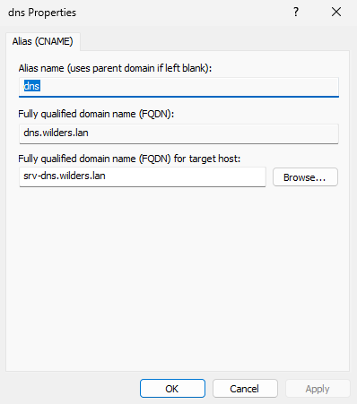
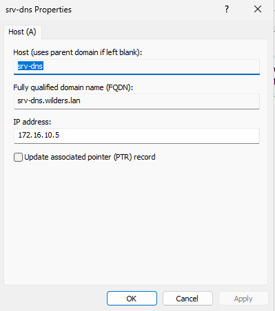
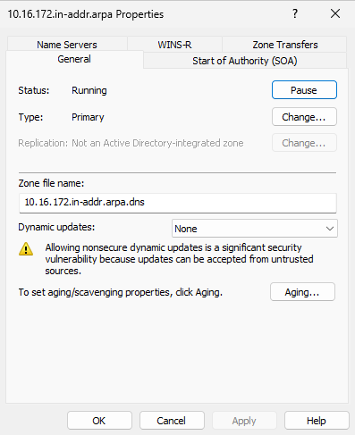
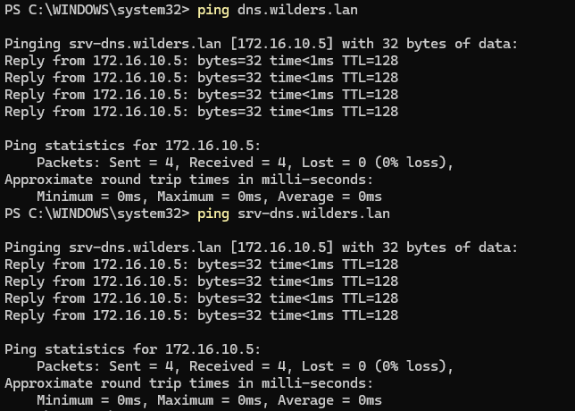
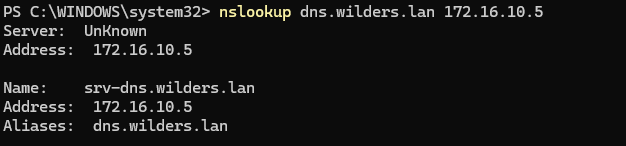
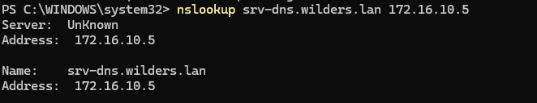

# TP DNS — Windows Server `wilders.lan`

**Serveur DNS :** `172.16.10.5`  
**Zone directe :** `wilders.lan`  
**Zone indirecte :** `10.16.172.in-addr.arpa`

---

## 1. Zone directe

> Configuration de la zone directe `wilders.lan` avec les enregistrements A (`srv-dns`) et CNAME (`dns`).

---

## 2. Zone indirecte

> Configuration de la zone inversée `10.16.172.in-addr.arpa` avec l'enregistrement PTR pointant vers `srv-dns.wilders.lan`.

---

## 3. Ping vers le nom A — `srv-dns.wilders.lan` et Ping vers le CNAME — `dns.wilders.lan`

> Ping depuis le client vers l'enregistrement A du serveur DNS.
> Ping depuis le client vers l'alias CNAME du serveur DNS.

---

## 5. nslookup depuis le client

> Résolution DNS directe `srv-dns.wilders.lan` et `dns.wilders.lan` .
